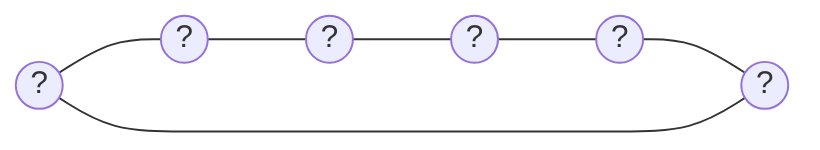

<!-- Generated by panopticon.diagrams from the compiled interface and dependency indices.
     Do not edit by hand: rebuilt automatically on every merge to a child repo's default branch. -->

# Organization architecture

No cross-repo interface or dependency relationships yet — see [initializing a child repo](setup-guide.md#4-initialize-a-child-repo).

