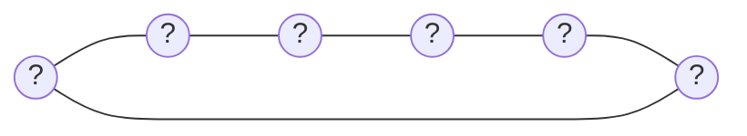

## Context

Architecture diagrams already exist at two levels — each repo's `## Architecture diagram` section and the
instance repo's compiled `docs/architecture.md` — and already link to each other (architecture-diagrams
capability's "Diagram navigation uses plain links, not in-diagram click-through"). Nothing links to either one
from a README, which is the first file anyone opens. Three README surfaces need links, and each has a
different derivation problem:

- **Instance repo README**: one relative link to its own `docs/architecture.md`. No timing problem — same
  repo, same commit.
- **Child repo README**: two links. The own-repo link has the same relative-link timing behavior as the
  existing diagram-section back-link (dead until merged into the instance). The org link needs to point at a
  *different* repo (the instance), so it can't be a relative link at all — the existing
  `panopticon/org_diagram_link.py` script already solved exactly this derivation problem for a different
  surface (a printed URL, not a README line).
- **Template repo README**: the current Overview paragraph describes the template mechanism itself
  ("this is a GitHub template repository...") and is copied byte-for-byte into every instance repo via "Use
  this template" — no post-copy transform runs, so whatever text sits in the template's README becomes every
  instance's starting README.

## Goals / Non-Goals

**Goals:**
- Every instance and child repo README links to the relevant diagram(s) at the top of the file, resolvable as
  soon as possible (immediately for the org link, at next merge for the own-repo link).
- A brand-new instance repo's architecture link is never dead, even before any child repo has merged.
- The template repo's own README stops describing itself once it's living as an instance repo's README.

**Non-Goals:**
- No new deterministic script or CI check enforcing the child README link block — verified confirmed with the
  user that agent-authored (via `panopticon-doc-generation`, same treatment as the diagram-section back-link)
  is the intended mechanism, not a parallel deterministic tool.
- No attempt to dynamically inject the org's actual name or system description into the template README on
  creation — confirmed infeasible (no GitHub event fires for template-based repo creation; `create`/`push` are
  documented as unreliable for this case; this project's own `sync-from-template.yml` is
  `workflow_dispatch`-only, not a creation hook).
- No change to `org_diagram_link.py` itself — the child README org link reuses its derivation logic/inputs,
  not its CLI output.

## Decisions

**Child README org link invokes `org_diagram_link`'s process directly, rather than duplicating its
derivation in prose.** Initially planned to have the skill re-derive the URL itself (config first, then a
described fallback). Reversed during implementation: `org_diagram_link.py`'s actual fallback is more
specific than a generic description captures — it resolves a token from `GH_TOKEN`/`GITHUB_TOKEN` or `gh
auth token`, then makes a live GitHub API GET, explicitly *not* a `gh api` subprocess call (see the
module's own docstring, design D11) — so restating it in a skill instruction risks drifting from the real
behavior, as an earlier draft of this change's own artifacts already did once. `panopticon-doc-generation`
already shells out to other `panopticon.*` modules for other rules (`panopticon.docs render`,
`panopticon.docs validate`); running `python3 -m panopticon.org_diagram_link` and using its printed line is
the same pattern, and guarantees the README's URL and the script's URL can never disagree.

**README link block is agent-authored, not deterministic tooling.** Considered making it a deterministic write
(like `interfaces.md`) with a drift check, since the block is fully derivable from config with zero judgment.
Rejected: the user confirmed the existing precedent — the diagram-section back-link is already agent-written
despite being just as mechanically derivable — and matching that precedent keeps one enforcement model instead
of two for closely related content. If drift becomes a real problem in practice, a check can be added later
without changing where the block lives.

**Empty-state placeholder lives in `write_org_diagram`, not just the template's seed file.** Shipping a static
placeholder file alone would go stale the moment `write_org_diagram` runs against a still-empty compiled index
(e.g. after an org customizes `panopticon.diagram.config.json` before any repo has merged) — a run that
produces nothing today. Making the empty-state case an explicit branch of the renderer means the placeholder
stays correct (right diagram format, right content) regardless of when it's viewed, and the template's shipped
copy is just that same render's output captured once, not a separately maintained artifact.

**Placeholder shape: hexagon of six `?` nodes.** Chosen by the user as a recognizable "nothing here yet, but
this is where repos will appear" visual, distinct from a real diagram (which never has uniform placeholder
labels) so nobody mistakes it for actual data. Mermaid default rendering:

Non-mermaid formats (per the existing configurable-format requirement) render the equivalent six-node ring in
their own syntax; the format used is whatever `write_org_diagram` would otherwise use for a populated diagram.

**Template README Overview is rewritten now, accepting template-repo-visible awkwardness.** Confirmed with the
user: since there's no creation hook, the only way for a new instance repo to start with better text is for
the template's own tracked README to already contain that text. The template repo's own GitHub page will
therefore show instance-facing boilerplate and a maintainer note aimed at instance owners, not template
visitors. The `## How it works` section below is untouched — it documents the system generally and is equally
valid to read in either repo role.

## Risks / Trade-offs

- **Template repo's public README reads oddly to template browsers/contributors** (a note addressed to
  "instance maintainers" on a page they're viewing as the template) → Accepted per explicit user confirmation;
  no mechanism exists to show different content without a creation hook that GitHub doesn't provide.
- **Child README org link can go stale if `instance` or `instance_default_branch` changes after doc generation
  last ran** → Same staleness window the existing diagram-section back-link and `org_diagram_link` script
  already have; not newly introduced by this change. Doc-drift's existing "resolve drift you find" rule
  (panopticon-doc-generation skill) covers it if an agent notices during a later pass.
- **Placeholder hexagon could be visually confused with a real diagram in a format that doesn't render `?`
  distinctly** → Mitigated by pairing it with the setup-guide link every time, so context is never link-less
  even if a reader skims past the diagram itself.

## Migration Plan

1. Add `write_org_diagram`'s empty-state branch (`panopticon/diagrams.py`).
2. Ship the template's own `docs/architecture.md` as that render's output, and rewrite the template's
   `README.md` Overview section plus maintainer note.
3. Add the README-link-writing rule to `panopticon-doc-generation`.
4. No migration needed for already-initialized child/instance repos beyond their next normal doc-generation
   pass or `write_org_diagram` run — nothing here is a breaking change to existing docs or index schema.

## Open Questions

None outstanding — link format, layout, enforcement mechanism, and the template-README tradeoff were all
confirmed directly with the user during exploration.
